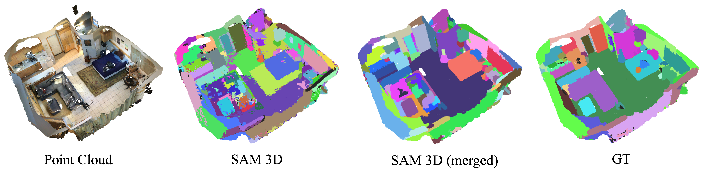
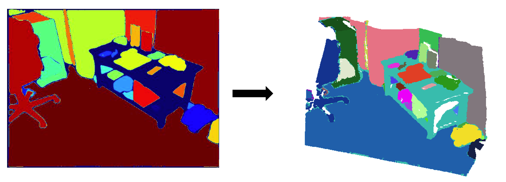
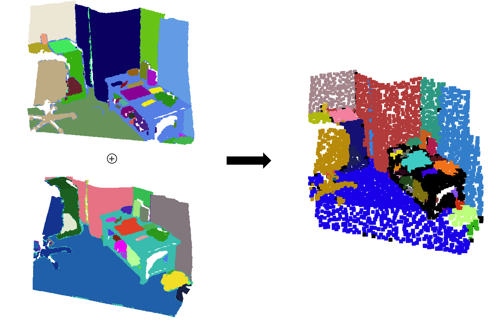
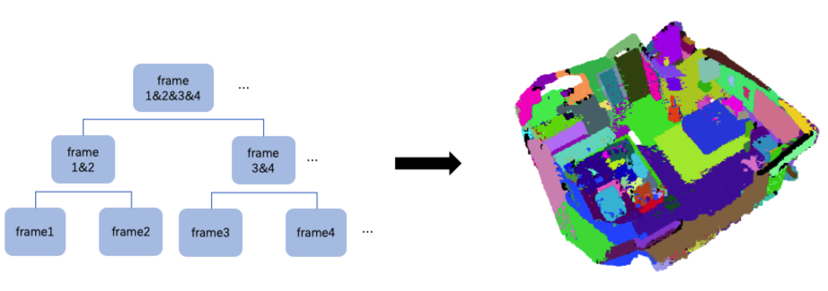
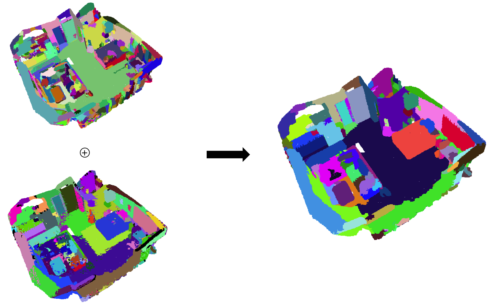

# Segment Anything 3D
- Authors: Yunhan Yang, [Xiaoyang Wu](https://xywu.me/), [Tong He](https://tonghe90.github.io/), [Hengshuang Zhao](https://hszhao.github.io/), [Xihui Liu](https://xh-liu.github.io/)
- Institutes: Shanghai Artificial Intelligence Lab, The University of Hong Kong
- Technical Report: [\[arxiv\]](https://arxiv.org/abs/2306.03908)

We extend [Segment Anything](https://github.com/facebookresearch/segment-anything) to 3D perception by transferring the segmentation information of 2D images to 3D space. We expect that the segment information can be helpful to 3D traditional perception and the open world perception. This project is still in progress, and it will be embedded into our perception codebase [Pointcept](https://github.com/Pointcept/Pointcept). We very much welcome any issue or pull request.

## Result
Example mesh is in [example_mesh](./example_mesh/).


## Installation
```
conda create -n sam3d python=3.8 -y
conda activate sam3d
# Choose version you want here: https://pytorch.org/get-started/previous-versions/
conda install pytorch==1.11.0 torchvision==0.12.0 torchaudio==0.11.0 cudatoolkit=11.3 -c pytorch
conda install plyfile -c conda-forge -y
pip install scikit-image opencv-python open3d imageio
pip install git+https://github.com/facebookresearch/segment-anything.git 

cd libs/pointops
# usual
python setup.py install
# docker & multi GPU arch
TORCH_CUDA_ARCH_LIST="ARCH LIST" python  setup.py install
# e.g. 7.5: RTX 3000; 8.0: a100 More available in: https://developer.nvidia.com/cuda-gpus
TORCH_CUDA_ARCH_LIST="7.5 8.0" python  setup.py install
cd ../..
```

## Data Preparation
### ScanNet v2
Download the [ScanNet](http://www.scan-net.org/) v2 dataset.\
Run preprocessing code for raw ScanNet as follows:
- Prepare PointCloud data (follow [Pointcept](https://github.com/Pointcept/Pointcept))
```
# RAW_SCANNET_DIR: the directory of downloaded ScanNet v2 raw dataset.
# PROCESSED_SCANNET_DIR: the directory of processed ScanNet dataset (output dir).
python scannet-preprocess/preprocess_scannet.py --dataset_root ${RAW_SCANNET_DIR} --output_root ${PROCESSED_SCANNET_DIR}
```
- Prepare RGBD data (follow [BPNet](https://github.com/wbhu/BPNet))
```
python scannet-preprocess/prepare_2d_data/prepare_2d_data.py --scannet_path data/scannetv2 --output_path data/scannetv2_images --export_label_images
```

## Getting Started
Please try it via [sam3d.py](./sam3d.py)
```
# RGB_PATH: the path of rgb data
# DATA_PATH: the path of pointcload data
# SAVE_PATH: Where to save the pcd results
# SAVE_2DMASK_PATH: Where to save 2D segmentation result from SAM
# SAM_CHECKPOINT_PATH: the path of checkpoint for SAM

python sam3d.py --rgb_path $RGB_PATH --data_path $DATA_PATH --save_path $SAVE_PATH --save_2dmask_path $SAVE_2DMASK_PATH --sam_checkpoint_path $SAM_CHECKPOINT_PATH 
```

## Pipeline
Our SegmentAnything3D pipeline looks as follows:

1. **SAM Generate Masks**\
Use SAM to get the segmentation masks on 2D frames and then map them into the 3D space via depth information.
<div align=center></div>

2. **Merge Two Adjacent Pointclouds**\
Use "Bidirectional-group-overlap-algorithm" (modified from [
ContrastiveSceneContexts](https://github.com/facebookresearch/ContrastiveSceneContexts)) to merge two adjacent pointclouds.
<div align=center></div>

3. **Region Merging Method**\
Merge the entire pointcloud by region merging method.
<div align=center></div>

4. **Merge 2 Segmentation Results**\
We apply Felzenswalb and Huttenlocher's Graph Based Image Segmentation algorithm to the scenes using the default parameters. Please refer to the [original repository](https://github.com/ScanNet/ScanNet/tree/master/Segmentator) for details. Then merge the 2 segmentation results to get the final result (merging code is in sam3d.py/pcd_ensemble).
<div align=center></div>

## Citation
If you find _SAM-3D_ useful to your research, please cite our work:
```
@misc{yang2023sam3d,
      title={SAM3D: Segment Anything in 3D Scenes}, 
      author={Yunhan Yang, Xiaoyang Wu, Tong He, Hengshuang Zhao and Xihui Liu},
      year={2023},
      eprint={2306.03908},
      archivePrefix={arXiv},
      primaryClass={cs.CV}
}
```

## Acknowledgements
SAM-3D is inspirited by the following repos: [Segment Anything](https://github.com/facebookresearch/segment-anything), [Pointcept](https://github.com/Pointcept/Pointcept), [BPNet](https://github.com/wbhu/BPNet), [ContrastiveSceneContexts](https://github.com/facebookresearch/ContrastiveSceneContexts).
